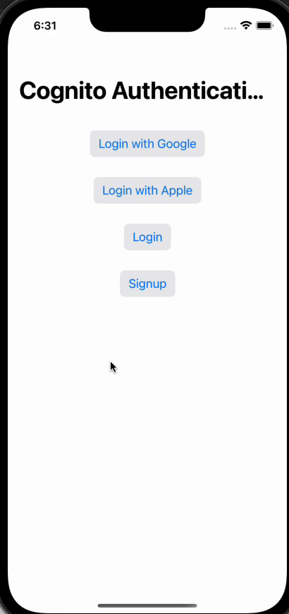

# AWS Cognito Login with Web Authentication in SwiftUI

This project demonstrates how to integrate AWS Cognito authentication with web-based login into a SwiftUI application using AWS auth api.
Your mobile app users can sign in through social identity providers (IdP) like Facebook, Google, Amazon, and Apple. With the built-in hosted web UI, Amazon Cognito provides token handling and management for all authenticated users.

## Table of Contents 

- [Demo UI](#demo)
- [Prerequisites](#prerequisites)
- [Features](#features)
- [Installation](#installation)
- [Usage and Configuration](#usage-and-configuration)
- [Contributing](#contributing)
- [Need Help / Support?](#need-help)
- [Collection of Components](#collection-of-Components)
- [License](#license)
- [Acknowledgements](#acknowledgements)
- [Keywords](#keywords)

# Demo UI 📱





## Prerequisites

Before you begin, you need the following:

A user pool with an app client and a user pool domain. For more information, see [Create a user pool](https://docs.aws.amazon.com/cognito/latest/developerguide/cognito-user-pool-as-user-directory.html).

- Xcode (latest version)
- An active Google developer app for google login.
- An active AppStore connect app & Bundle ID from apple developer.
- An active Facebook developer app for facebook login. 

See more to configure proper [User Guide](https://docs.aws.amazon.com/cognito/latest/developerguide/cognito-user-pools-social-idp.html)

# Features 🥳

App demo has feature as:

* Social login on cognito.
* Simple and secure login with web auth.
* Token based api accessed & login.
* Not any third party dependency or SDK needed.
* User profile management by itself.
* Support latest iOS 17.0

# Installation 💾

The instructions on how to install or run this demo:

* Clone the repository.
* Open the project in Xcode.
* Build and run the project.

# Configuration 👩🏾‍🔬

## Configure Federated Signin (google, facebook, apple and others)
Follow step by step to configure user pool and get all necessary keys and IDs from there for more information about setup [see here](https://docs.aws.amazon.com/cognito/latest/developerguide/cognito-user-pools-social-idp.html)

```swift

    user_pool_domain = "<your_user_pool_domain>"
    redirect_uri = "<your_redirect_uri>"
    client_id = "<your_user_pool_client_id>"
    client_secret = "<your_user_pool_client_secret>"
    app_scope =  "<your_app_scope>" // eg: "aws.cognito.signin.user.admin+email+openid+phone+profile"
    
```

# Usage 👩🏾‍🔬

In order to use this into your project need to drag & drop Helper folder files into your project and write the code into your contentview file like below.

```swift

struct ContentView: View {
    
    @ObservedObject var viewModel = WebViewModel()
    @State var isSheetOpen = false
    
    var body: some View {
                ----
                .sheet(isPresented: $isSheetOpen,onDismiss: {
                    isSheetOpen = false
                }) {
                    App_WebView(loadingUrl: self.getUrlFor(type: self.loginType), viewModel: viewModel)
                }
              ----
            }
        }

```

## Helper Method

To use web page url based on login type.


```swift

        func getUrlFor(type: String)->String {
        var webUrl = ""
        if type == LoginType.Google.rawValue {
            let identity_provider = "Google"
            webUrl = "\(CognitoKeys().user_pool_domain)/oauth2/authorize?identity_provider=\(identity_provider)&client_id=\(CognitoKeys().client_id)&response_type=code&scope=\(CognitoKeys().app_scope)&redirect_uri=\(CognitoKeys().redirect_uri)"
        } else if type == LoginType.SignInWithApple.rawValue {
            let identity_provider = "SignInWithApple"
            webUrl = "\(CognitoKeys().user_pool_domain)/oauth2/authorize?identity_provider=\(identity_provider)&client_id=\(CognitoKeys().client_id)&response_type=code&scope=\(CognitoKeys().app_scope)&redirect_uri=\(CognitoKeys().redirect_uri)"
        } else if type == LoginType.UserSignUp.rawValue {
            let identity_provider = ""
            webUrl = "\(CognitoKeys().user_pool_domain)/signup?identity_provider=\(identity_provider)&client_id=\(CognitoKeys().client_id)&response_type=code&redirect_uri=\(CognitoKeys().redirect_uri)"
            
        } else if type == LoginType.UserSignIn.rawValue {
            webUrl = "\(CognitoKeys().user_pool_domain)/login?client_id=\(CognitoKeys().client_id)&response_type=code&scope=\(CognitoKeys().app_scope)&redirect_uri=\(CognitoKeys().redirect_uri)"
        }
        return webUrl
    }
    

```

Now that you have all set to login and get user detail directly into your view.


# Contributing

- Created something awesome, made this code better, added some functionality, or whatever (this is the hardest part).
- [Fork it](http://help.github.com/forking/).
- Create new branch to contribute your changes.
- Commit all your changes to your branch.
- Submit a [pull request](http://help.github.com/pull-requests/).


# Need Help? 

We also provide a free, basic support for all users who want to use this coordinator master demo in project. In case you want to customize this demo input to suit your development needs, then feel free to contact our [iOS Developers](https://www.weblineindia.com/hire-ios-app-developers.html).

# Collection of Components

We have built many other components and free resources for software development in various programming languages. Kindly click here to view our [Free Resources for Software Development.](https://www.weblineindia.com/software-development-resources.html)

# Changelog

Detailed changes for each release are documented in [CHANGELOG](./CHANGELOG).

# License 📃

This project is licensed under the MIT License. Feel free to use, modify, and distribute the code as permitted by the license.

# Acknowledgements

This app was created using SwiftUI and leverages various libraries and resources. We would like to acknowledge and express our gratitude to the following:
* SwiftUI: Apple's declarative framework for building user interfaces.
* Xcode: Integrated development environment (IDE) provided by Apple.
* Open-source libraries: Various open-source libraries and frameworks used in the project.
* Community contributors: Contributors who have provided support, bug fixes, and enhancements.

# Keywords

Cognito login Master, Amazon Social Authentication, AWS Cognito Login Component, Web Auth Social Login Component, Swift5, iOS 17, WeblineIndia
